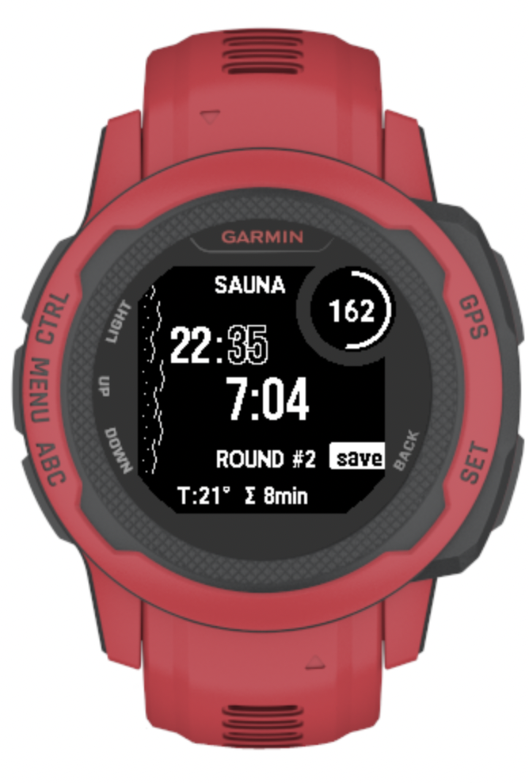

# 🧖 SaunaTracker

A minimalist sauna session tracker app for Garmin watches with real-time heart rate monitoring, temperature tracking, and multi-round session support.



## ✨ Features

- **⏱️ Countdown Timer** - Customizable session duration (default 15 minutes)
- **❤️ Heart Rate Monitoring** - Real-time display in MZ (max zone) circle
- **🌡️ Temperature Tracking** - Ambient temperature from device sensor
- **🔄 Multi-Round Support** - Track multiple sauna rounds with rest periods
- **💾 FIT Activity Recording** - Saves sessions to Garmin Connect
- **🌫️ Atmospheric Steam Effect** - Visual sauna atmosphere on left side
- **🎨 Custom Typography** - Bold hours, outlined minutes for better readability

## 📱 Display Elements

- **Top Right Circle**: Live heart rate (MZ indicator with progress ring during sauna)
- **Top Left**: Current time with custom styling (bold hours, outlined minutes)
- **Center**: Large countdown timer (shows overtime with + prefix)
- **Middle**: Round number (SAUNA) or rest status (REST)
- **Bottom**: Temperature and total session duration
- **Left Side**: Decorative steam effect (active during sauna rounds only)

## 🎮 Controls

### Before Session Starts:
- **UP (top left)**: Increase duration by 1 minute
- **DOWN (bottom left)**: Decrease duration by 1 minute
- **SELECT/GPS (top right)**: Start session

### During Session:
- **SELECT/GPS (top right)**: 
  - In sauna → Switch to rest mode
  - In rest → Start next sauna round
- **DOWN (bottom left)**: 
  - **Round 1 only** → Cancel workout ("cncl" button)
  - Round 2+ → Inactive
- **BACK (bottom right)**: Save session and exit ("save" button)

## 🔧 Installation

1. Download the `.prg` file from releases
2. Connect your Garmin watch to computer
3. Copy the file to `GARMIN/Apps/` folder
4. Safely eject watch
5. Find "SaunaTracker" in your apps

## 📊 Session Flow

```
Setup → Round 1 (Sauna) → Rest → Round 2 (Sauna) → Rest → ... → Save
```

- Each sauna round counts down from configured duration
- Overtime tracking with visual indicators
- Rest periods count up from 0
- Temperature and heart rate tracked throughout

## 🌡️ Temperature Sensor

The app uses your device's built-in temperature sensor via `SensorHistory` API. Temperature displays as "--" if:
- Sensor is warming up
- Watch not worn properly
- No temperature data available

## ⚙️ Technical Details

- **Language**: Monkey C
- **SDK**: Connect IQ 8.4.0+
- **API Level**: 3.4.0+
- **Activity Type**: Training/Strength Training
- **Data Fields**: Heart Rate, Temperature, Duration

## 🎯 Compatibility

- ✅ Garmin Instinct 2S
- ✅ Garmin Instinct 2S Solar Surf
- ✅ Other devices with 156x156 MIP display (should work)

## 🏗️ Building from Source

```bash
# Compile
monkeyc -o bin/SaunaTracker.prg \
        -f monkey.jungle \
        -y developer_key.der \
        -d instinct2s \
        -w

# Run in simulator
connectiq &
monkeydo bin/SaunaTracker.prg instinct2s
```

## 📚 Documentation

For detailed guides and setup instructions, see the [`docs/`](docs/) folder:

- [`docs/QUICK_START.txt`](docs/QUICK_START.txt) - Quick reference guide
- [`docs/SIMULATOR_GUIDE.md`](docs/SIMULATOR_GUIDE.md) - Detailed simulator usage guide
- [`docs/SETUP.md`](docs/SETUP.md) - Environment setup instructions
- [`docs/SUMMARY.md`](docs/SUMMARY.md) - Project overview and status
- [`docs/FINAL_FIX.md`](docs/FINAL_FIX.md) - Final fixes applied
- [`docs/FIX_APPLIED.md`](docs/FIX_APPLIED.md) - Fix documentation

## 📝 License

This project is open source and available for personal use.

## 🙏 Credits

Developed for optimal sauna training tracking with focus on simplicity and readability.

---

**Enjoy your sauna sessions! 🧖‍♂️🔥**
